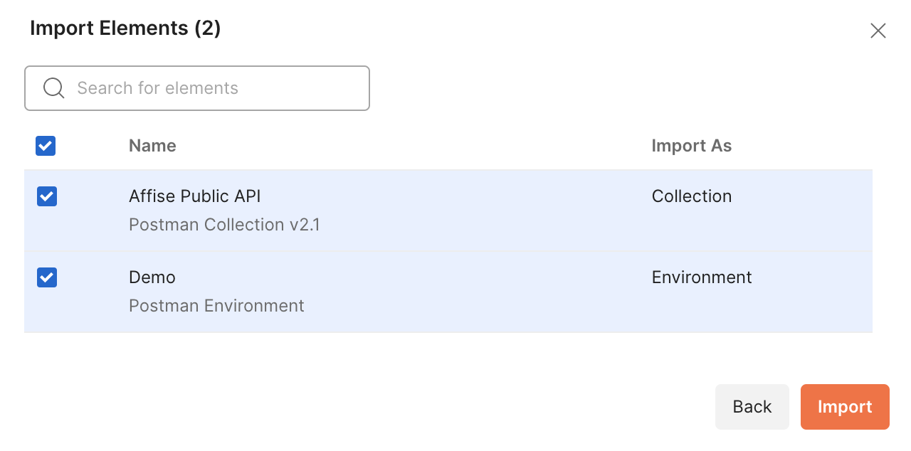
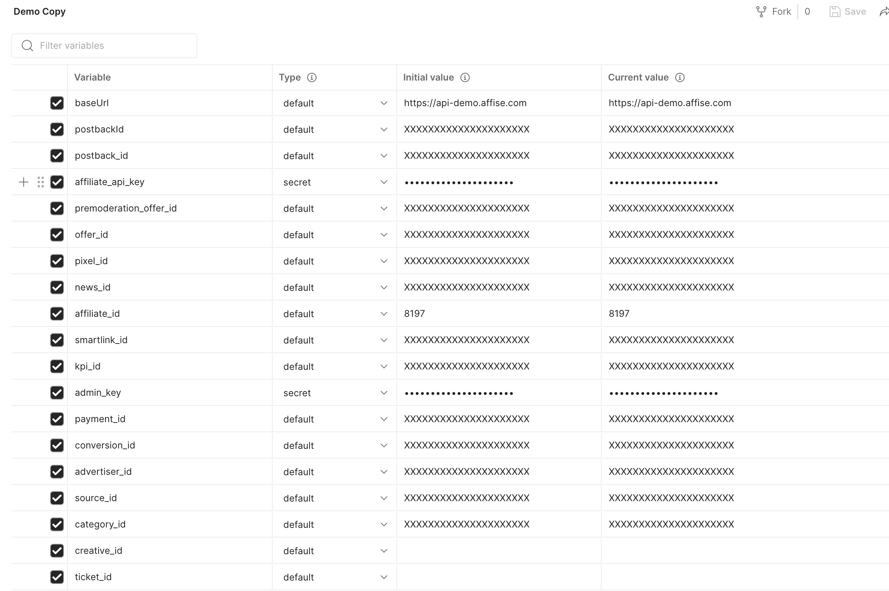
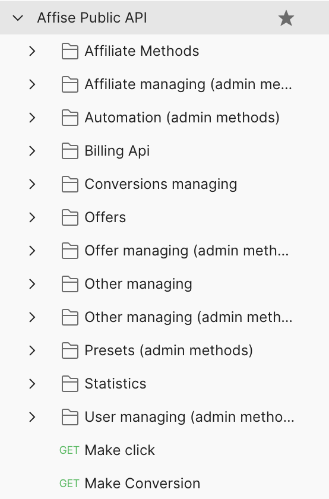

# affise-postman
Public API for postman according to https://api.affise.com

## How to use
- Import Postman API collection 
- Import Postman Environment
- 
- Change variables in Postman Environment
- 

- Use collection
- 
